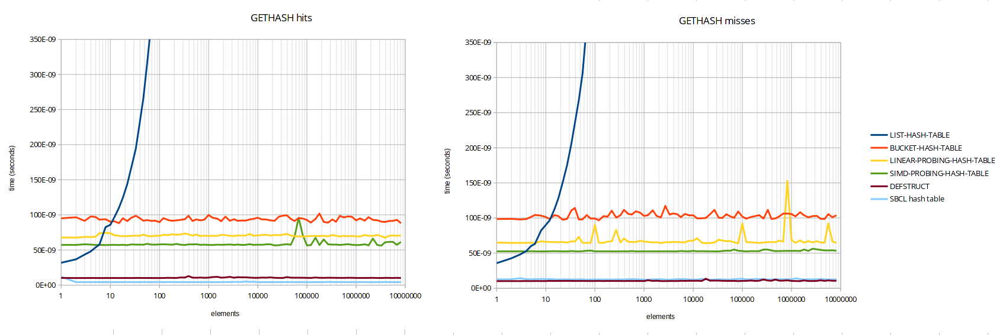

# A "port" of linear-probing-hash-table with SIMD intrinsics

This is a "port" of SICL's [linear-probing-hash-table](https://github.com/robert-strandh/SICL/tree/master/Code/Hash-tables/Linear-probing)
which uses SSE2 intrinsics for faster probing. Only the metadata table 
implementation had to be modified to use SSE; and this implementation
was done almost by renaming the fake `sse:blah` function names in the
`simd-metadata-table.example.lisp` file.

As we use unportable assembler stuff, you will need SBCL 2.0.10 (or
so) and [my fork of
cl-simd](https://github.com/no-defun-allowed/cl-simd), as well as an
AMD64 processor with the `bsf` instruction. (I don't know when that
was introduced, the availability of instruction set extensions confuse
me.) It won't work in SBCL 2.1.0 because they changed `make-ea` or
something, so that effective addresses don't carry around sizes, and
I have no idea how to patch around that.
